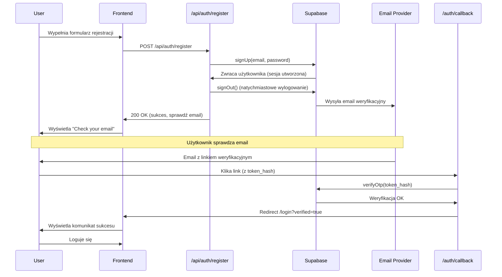
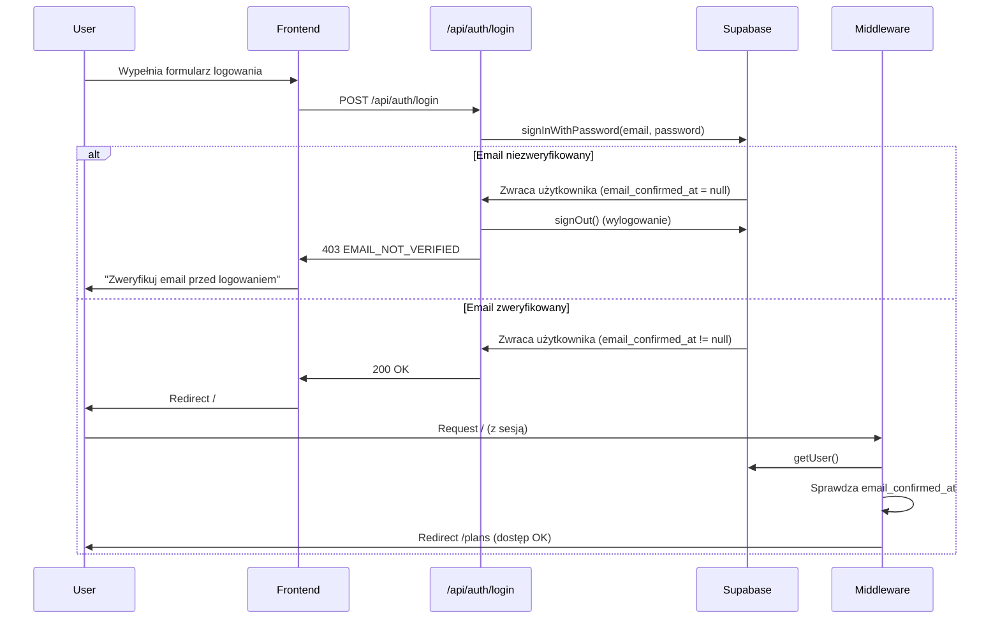

# Poprawki Procesu Rejestracji - Podsumowanie

## Zidentyfikowane Problemy

### 1. Email weryfikacyjny nie dociera

**Przyczyna:** Supabase domyślnie używa wbudowanego email providera z ograniczeniami (3-4 emaile/godzinę, często blokowany przez spam).

**Rozwiązanie:**

- Utworzono szczegółową dokumentację konfiguracji SMTP: `docs/auth/supabase-email-configuration.md`
- Zalecane providery: SendGrid, Mailgun, AWS SES, Resend
- Dla testów: użyj aliasów Gmail (`email+test1@gmail.com`) i sprawdź folder spam

### 2. Błędne przekierowanie z "Back to login"

**Przyczyna:** Po rejestracji użytkownik otrzymywał sesję w Supabase (mimo niezweryfikowanego emaila), więc middleware przekierowywał go na `/plans` zamiast na `/login`.

**Rozwiązanie:**

- Endpoint `/api/auth/register` teraz natychmiast wylogowuje użytkownika po rejestracji
- Middleware sprawdza czy email jest zweryfikowany (`email_confirmed_at !== null`)
- Tylko użytkownicy z zweryfikowanym emailem są traktowani jako zalogowani

### 3. Brak weryfikacji emaila przy logowaniu

**Przyczyna:** Endpoint logowania nie sprawdzał czy email został zweryfikowany.

**Rozwiązanie:**

- Endpoint `/api/auth/login` teraz sprawdza `email_confirmed_at`
- Jeśli email nie jest zweryfikowany, użytkownik otrzymuje błąd 403 z odpowiednim komunikatem
- Sesja jest natychmiast zamykana dla niezweryfikowanych użytkowników

### 4. Brak obsługi callback po weryfikacji

**Przyczyna:** Nie było endpointu do obsługi linku weryfikacyjnego z emaila.

**Rozwiązanie:**

- Utworzono `/auth/callback` do obsługi weryfikacji emaila
- Endpoint weryfikuje token z Supabase i przekierowuje na `/login` z komunikatem sukcesu
- Obsługuje również błędy (wygasły link, nieprawidłowy token)

## Wprowadzone Zmiany

### 1. `/src/pages/api/auth/register.ts`

```typescript
// Zmiany:
- Zmieniono emailRedirectTo z /login na /auth/callback
- Dodano natychmiastowe wylogowanie po rejestracji (signOut)
- Usunięto niepotrzebne data.email_confirmed w options
```

### 2. `/src/pages/api/auth/login.ts`

```typescript
// Zmiany:
- Dodano sprawdzenie email_confirmed_at
- Zwracany błąd 403 z kodem EMAIL_NOT_VERIFIED dla niezweryfikowanych
- Natychmiastowe wylogowanie przy braku weryfikacji
```

### 3. `/src/middleware/index.ts`

```typescript
// Zmiany:
- Dodano sprawdzenie email_confirmed_at przy ustawianiu locals.user
- Dodano /auth/callback do PUBLIC_PATHS
- Tylko zweryfikowani użytkownicy są traktowani jako zalogowani
```

### 4. `/src/components/auth/LoginForm.tsx`

```typescript
// Zmiany:
- Dodano useEffect do obsługi parametrów URL (verified, error)
- Dodano wyświetlanie komunikatu sukcesu po weryfikacji
- Dodano obsługę błędu EMAIL_NOT_VERIFIED (403)
- Dodano import Alert (przygotowanie na przyszłe komunikaty)
```

### 5. `/src/pages/auth/callback.ts` (NOWY)

```typescript
// Funkcjonalność:
- Obsługuje weryfikację emaila z linku
- Weryfikuje token_hash z Supabase
- Przekierowuje na /login z odpowiednim komunikatem
- Obsługuje błędy (wygasły link, nieprawidłowy token)
```

### 6. `/docs/auth/supabase-email-configuration.md` (NOWY)

Szczegółowa dokumentacja konfiguracji email providera:

- Instrukcje dla SendGrid, Mailgun, AWS SES
- Konfiguracja SMTP w Supabase Dashboard
- Dostosowanie szablonów email
- Troubleshooting
- Rekomendacje dla produkcji

## Przepływ Rejestracji (Po Zmianach)



## Przepływ Logowania (Po Zmianach)



## Testowanie

### Test 1: Rejestracja nowego użytkownika

1. Przejdź na `/register`
2. Wprowadź email i hasło
3. Kliknij "Create account"
4. **Oczekiwany wynik:** Wyświetla się "Check your email"
5. Kliknij "Back to login"
6. **Oczekiwany wynik:** Przekierowanie na `/login` (NIE na `/plans`)

### Test 2: Próba logowania przed weryfikacją

1. Zarejestruj nowego użytkownika (bez klikania linku w emailu)
2. Przejdź na `/login`
3. Wprowadź dane logowania
4. **Oczekiwany wynik:** Błąd "Please verify your email address before logging in"

### Test 3: Weryfikacja emaila

1. Sprawdź skrzynkę email (również spam)
2. Kliknij link weryfikacyjny
3. **Oczekiwany wynik:** Przekierowanie na `/login?verified=true` z komunikatem sukcesu
4. Zaloguj się
5. **Oczekiwany wynik:** Przekierowanie na `/plans` (dostęp OK)

### Test 4: Wygasły link weryfikacyjny

1. Poczekaj 24h lub użyj starego linku
2. Kliknij link
3. **Oczekiwany wynik:** Przekierowanie na `/login?error=link_expired` z odpowiednim komunikatem

## Konfiguracja Email Provider (WYMAGANE dla produkcji)

### Szybki Start z SendGrid (Zalecane)

1. **Zarejestruj się:** https://sendgrid.com
2. **Utwórz API Key:**
   - Settings → API Keys → Create API Key
   - Uprawnienia: "Mail Send"
3. **Skonfiguruj w Supabase:**
   - Project Settings → Auth → Email Templates
   - Enable Custom SMTP
   - Host: `smtp.sendgrid.net`
   - Port: `587`
   - Username: `apikey`
   - Password: `<twój_api_key>`
   - Sender: `noreply@yourdomain.com`

### Weryfikacja konfiguracji

1. Zarejestruj testowego użytkownika
2. Sprawdź logi: Supabase Dashboard → Logs → Auth Logs
3. Szukaj eventów `user.signup` i `email.sent`

## Bezpieczeństwo

### Implementowane zabezpieczenia:

✅ Weryfikacja emaila wymagana przed dostępem
✅ Natychmiastowe wylogowanie po rejestracji
✅ Sprawdzanie `email_confirmed_at` w middleware
✅ Sprawdzanie `email_confirmed_at` przy logowaniu
✅ Bezpieczne przekierowania
✅ Obsługa wygasłych linków
✅ Generyczne komunikaty błędów (nie ujawniamy czy email istnieje)

### Dodatkowe zabezpieczenia do rozważenia:

- Rate limiting dla endpointów auth
- CAPTCHA dla rejestracji
- 2FA (opcjonalnie)
- Monitoring prób logowania

## Znane Ograniczenia

1. **Domyślny Email Provider Supabase:**
   - Limit 3-4 emaile/godzinę
   - Może trafiać do spamu
   - NIE zalecany dla produkcji

2. **Link weryfikacyjny:**
   - Ważny 24 godziny
   - Jednorazowy (nie można użyć ponownie)

3. **Resend weryfikacji:**
   - Obecnie nie zaimplementowany
   - Do dodania w przyszłości (przycisk "Resend email")

## Następne Kroki

### Priorytet 1 (Wymagane):

- [ ] Skonfigurować SMTP provider (SendGrid/Mailgun)
- [ ] Przetestować pełny przepływ rejestracji
- [ ] Dostosować szablony email do brandingu

### Priorytet 2 (Zalecane):

- [ ] Dodać przycisk "Resend verification email"
- [ ] Dodać rate limiting dla auth endpoints
- [ ] Skonfigurować SPF/DKIM dla domeny
- [ ] Dodać monitoring wysyłki emaili

### Priorytet 3 (Opcjonalne):

- [ ] Dodać CAPTCHA dla rejestracji
- [ ] Zaimplementować 2FA
- [ ] Dodać social login (Google, GitHub)
- [ ] Dodać progress bar dla siły hasła

## Pliki do Review

Przed wdrożeniem na produkcję, zreviewuj:

1. `/src/pages/api/auth/register.ts` - endpoint rejestracji
2. `/src/pages/api/auth/login.ts` - endpoint logowania
3. `/src/middleware/index.ts` - middleware auth
4. `/src/pages/auth/callback.ts` - obsługa weryfikacji
5. `/src/components/auth/LoginForm.tsx` - formularz logowania
6. `/src/components/auth/RegisterForm.tsx` - formularz rejestracji

## Dodatkowe Zasoby

- [Supabase Auth Documentation](https://supabase.com/docs/guides/auth)
- [Supabase Email Configuration](https://supabase.com/docs/guides/auth/auth-smtp)
- [SendGrid Integration Guide](https://docs.sendgrid.com/)
- [Email Verification Best Practices](https://supabase.com/docs/guides/auth/auth-email-templates)
