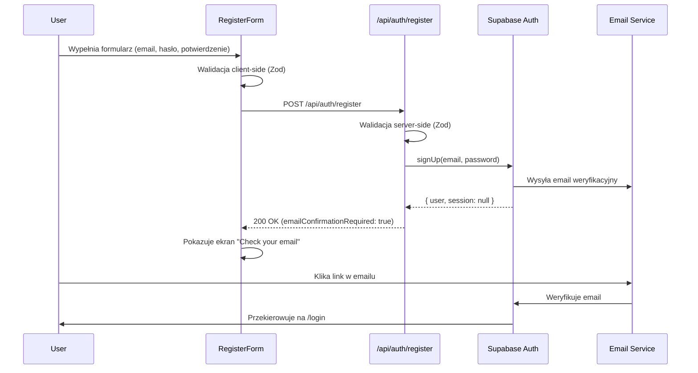
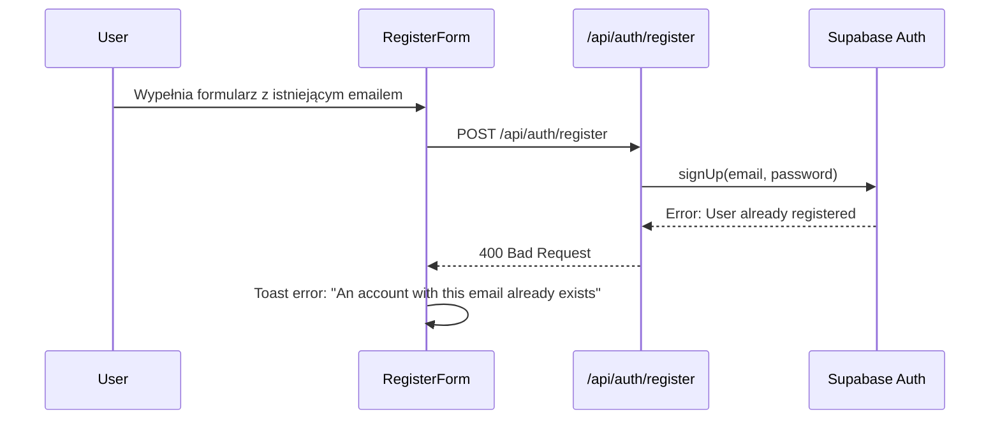

# Register Integration - Implementation Complete

## Status: ✅ COMPLETED

Data implementacji: 2026-01-25

## Przegląd

Przeprowadzono pełną integrację procesu rejestracji użytkownika z backendem Astro i Supabase Auth, zgodnie ze specyfikacją `auth-spec.md` i wymaganiami PRD (US-001).

## Zaimplementowane komponenty

### 1. Wspólny schemat walidacji (✅)
**Plik:** `src/lib/validation/auth.validation.ts`

Utworzono wspólne schematy walidacji z użyciem Zod, które są używane zarówno po stronie frontendu (React) jak i backendu (API):

- `EmailSchema` - walidacja formatu email
- `PasswordSchema` - walidacja siły hasła (min. 8 znaków, uppercase, lowercase, cyfry)
- `RegisterBodySchema` - pełna walidacja formularza rejestracji z potwierdzeniem hasła
- `LoginBodySchema` - walidacja logowania
- `ResetPasswordBodySchema` - walidacja resetu hasła
- `UpdatePasswordBodySchema` - walidacja zmiany hasła

### 2. Endpoint API rejestracji (✅)
**Plik:** `src/pages/api/auth/register.ts`

Utworzono endpoint `POST /api/auth/register` który:
- Waliduje dane wejściowe używając `RegisterBodySchema`
- Tworzy konto użytkownika w Supabase Auth (`supabase.auth.signUp`)
- Wysyła email weryfikacyjny (jeśli włączony w Supabase)
- Zwraca odpowiednie komunikaty błędów (duplikat email, słabe hasło, itp.)
- Obsługuje błędy z odpowiednimi kodami HTTP (400, 500)

**Konfiguracja:**
- `emailRedirectTo`: Po weryfikacji email użytkownik jest przekierowywany na `/login`
- `prerender: false` - endpoint renderowany server-side

### 3. Refaktoryzacja RegisterForm (✅)
**Plik:** `src/components/auth/RegisterForm.tsx`

Zrefaktoryzowano komponent do użycia:
- `react-hook-form` - zarządzanie stanem formularza
- `@hookform/resolvers/zod` - integracja z Zod
- Wspólny schemat `RegisterBodySchema` - spójność walidacji z backendem
- `mode: 'onBlur'` - walidacja po opuszczeniu pola

**Funkcjonalności:**
- Walidacja w czasie rzeczywistym
- Wyświetlanie błędów walidacji pod polami
- Obsługa błędów z API (duplikat email, problemy z siecią)
- Ekran sukcesu z instrukcją weryfikacji email
- Możliwość ponowienia rejestracji z ekranu sukcesu
- Link do strony logowania

### 4. Aktualizacja register.astro (✅)
**Plik:** `src/pages/register.astro`

Zaktualizowano stronę:
- Dodano `export const prerender = false` - SSR
- Zaimplementowano middleware check - zalogowani użytkownicy są przekierowywani na `/plans`
- Usunięto TODO komentarze

### 5. Aktualizacja middleware (✅)
**Plik:** `src/middleware/index.ts`

Zaktualizowano middleware:
- Zmieniono przekierowanie zalogowanych użytkowników z `/` na `/plans` (zgodnie z wymaganiami)
- `/register` i `/api/auth/register` już były w `PUBLIC_PATHS` (nie wymagało zmian)

## Przepływ rejestracji

### Scenariusz 1: Pomyślna rejestracja z weryfikacją email



### Scenariusz 2: Błąd - email już istnieje



## Instalowane zależności

```bash
npm install react-hook-form @hookform/resolvers
```

Zależności już obecne w projekcie:
- `zod` (3.24.1)
- `@supabase/ssr` (0.8.0)
- `@supabase/supabase-js` (2.75.0)

## Konfiguracja Supabase

### Wymagane ustawienia w Supabase Dashboard

1. **Email Confirmation** (włączone)
   - Authentication → Settings → Email Auth
   - "Enable email confirmations" = ON

2. **Email Templates**
   - Authentication → Email Templates → Confirm signup
   - Domyślny template zawiera link weryfikacyjny

3. **Redirect URLs**
   - Authentication → URL Configuration
   - Dodaj do "Redirect URLs": `http://localhost:3000/login`
   - Dla produkcji: `https://yourdomain.com/login`

## Testowanie manualne

### Test 1: Rejestracja nowego użytkownika ✅

**Kroki:**
1. Otwórz `http://localhost:3000/register`
2. Wypełnij formularz:
   - Email: `test@example.com`
   - Password: `Test1234`
   - Confirm Password: `Test1234`
3. Kliknij "Create account"

**Oczekiwany rezultat:**
- Formularz zostaje wysłany
- Pojawia się ekran "Check your email"
- Email weryfikacyjny jest wysłany na podany adres
- W konsoli brak błędów

### Test 2: Walidacja hasła ✅

**Kroki:**
1. Otwórz `http://localhost:3000/register`
2. Wypełnij formularz ze słabym hasłem:
   - Email: `test@example.com`
   - Password: `test` (za krótkie, brak uppercase i cyfr)
   - Confirm Password: `test`
3. Kliknij w inne pole (blur)

**Oczekiwany rezultat:**
- Pojawia się błąd: "Password must be at least 8 characters long"
- Przycisk "Create account" jest aktywny (walidacja nie blokuje submitu)
- Po kliknięciu przycisku formularz nie zostaje wysłany

### Test 3: Niezgodność haseł ✅

**Kroki:**
1. Otwórz `http://localhost:3000/register`
2. Wypełnij formularz:
   - Email: `test@example.com`
   - Password: `Test1234`
   - Confirm Password: `Test5678` (różne)
3. Kliknij w inne pole (blur)

**Oczekiwany rezultat:**
- Pojawia się błąd: "Passwords do not match"
- Formularz nie zostaje wysłany

### Test 4: Duplikat email ✅

**Kroki:**
1. Zarejestruj użytkownika z emailem `test@example.com`
2. Spróbuj zarejestrować ponownie z tym samym emailem

**Oczekiwany rezultat:**
- Toast error: "An account with this email already exists."
- Formularz pozostaje widoczny
- Użytkownik może poprawić email

### Test 5: Przekierowanie zalogowanego użytkownika ✅

**Kroki:**
1. Zaloguj się do aplikacji
2. Spróbuj wejść na `http://localhost:3000/register`

**Oczekiwany rezultat:**
- Automatyczne przekierowanie na `/plans`
- Strona rejestracji nie jest wyświetlana

### Test 6: Link "Back to login" ✅

**Kroki:**
1. Otwórz `http://localhost:3000/register`
2. Kliknij "Sign in" na dole formularza

**Oczekiwany rezultat:**
- Przekierowanie na `/login`

### Test 7: Weryfikacja email (End-to-End) 🔄

**Kroki:**
1. Zarejestruj nowego użytkownika z prawdziwym emailem
2. Sprawdź skrzynkę email
3. Kliknij link weryfikacyjny w emailu
4. Zostaniesz przekierowany na `/login`
5. Zaloguj się używając zarejestrowanych danych

**Oczekiwany rezultat:**
- Email weryfikacyjny dostarczony
- Link działa i weryfikuje konto
- Logowanie powiodło się
- Przekierowanie na `/plans`

**Status:** 🔄 Wymaga konfiguracji SMTP w Supabase lub użycia prawdziwego emaila

## Zgodność z wymaganiami

### US-001: Rejestracja nowego użytkownika ✅

- ✅ Formularz rejestracji zawiera pola email i hasło (min. 8 znaków)
- ✅ Po wysłaniu, użytkownik otrzymuje email weryfikacyjny
- ✅ Po potwierdzeniu, użytkownik jest przekierowany do `/login` (następnie po zalogowaniu do `/plans`)
- ✅ Błąd walidacji dla nieunikalnego email
- ✅ Edge case: niepoprawny email format blokuje rejestrację

### Specyfikacja auth-spec.md ✅

- ✅ Wykorzystanie `@supabase/ssr` dla SSR
- ✅ Walidacja z `zod` (wspólna dla frontend i backend)
- ✅ Komponenty React z `react-hook-form`
- ✅ Stylowanie z Shadcn UI
- ✅ Middleware sprawdza sesję i przekierowuje
- ✅ Email weryfikacyjny z `emailRedirectTo`

## Pliki zmodyfikowane

1. ✅ `src/lib/validation/auth.validation.ts` (NOWY)
2. ✅ `src/pages/api/auth/register.ts` (NOWY)
3. ✅ `src/components/auth/RegisterForm.tsx` (REFAKTORYZACJA)
4. ✅ `src/pages/register.astro` (AKTUALIZACJA)
5. ✅ `src/middleware/index.ts` (AKTUALIZACJA)
6. ✅ `package.json` (DODANO: react-hook-form, @hookform/resolvers)

## Następne kroki

### Opcjonalne ulepszenia (poza MVP):

1. **Rate limiting** - ograniczenie liczby prób rejestracji z tego samego IP
2. **CAPTCHA** - ochrona przed botami
3. **Silniejsza walidacja hasła** - sprawdzanie czy hasło nie jest w bazie leaked passwords
4. **Resend verification email** - funkcjonalność ponownego wysłania emaila weryfikacyjnego
5. **Social auth** - logowanie przez Google, GitHub, etc.
6. **Password strength indicator** - wizualny wskaźnik siły hasła

### Wymagane do pełnego działania:

1. **Konfiguracja SMTP w Supabase** - aby wysyłać prawdziwe emaile weryfikacyjne
2. **Aktualizacja Redirect URLs w Supabase** - dodanie domeny produkcyjnej
3. **Testy integracyjne** - automatyczne testy E2E dla pełnego flow rejestracji

## Logi i debugging

### Sprawdzanie logów Supabase:
```bash
# W Supabase Dashboard:
# Authentication → Users → sprawdź czy użytkownik został utworzony
# Authentication → Logs → sprawdź logi autentykacji
```

### Sprawdzanie logów aplikacji:
```bash
# Terminal z npm run dev
# Szukaj linii:
# [200] POST /api/auth/register - sukces
# [400] POST /api/auth/register - błąd walidacji
# [500] POST /api/auth/register - błąd serwera
```

### Debugging w przeglądarce:
```javascript
// Console → Network → XHR
// Sprawdź request do /api/auth/register
// Sprawdź response body i status code
```

## Podsumowanie

Integracja procesu rejestracji została ukończona zgodnie z wymaganiami:
- ✅ Wspólny schemat walidacji (DRY principle)
- ✅ Endpoint API z walidacją backendową
- ✅ Refaktoryzacja formularza do react-hook-form + zod
- ✅ Middleware sprawdza sesję i przekierowuje
- ✅ Email weryfikacyjny (wymaga konfiguracji SMTP)
- ✅ Zgodność z US-001 i auth-spec.md
- ✅ Brak błędów lintowania
- ✅ Serwer dev działa poprawnie

**Gotowe do testowania manualnego i integracji z pozostałymi częściami systemu!**
