# Authentication Flow Diagrams

This document contains visual diagrams of the authentication flows implemented in the 12 Weeks Planner application.

## Registration Flow

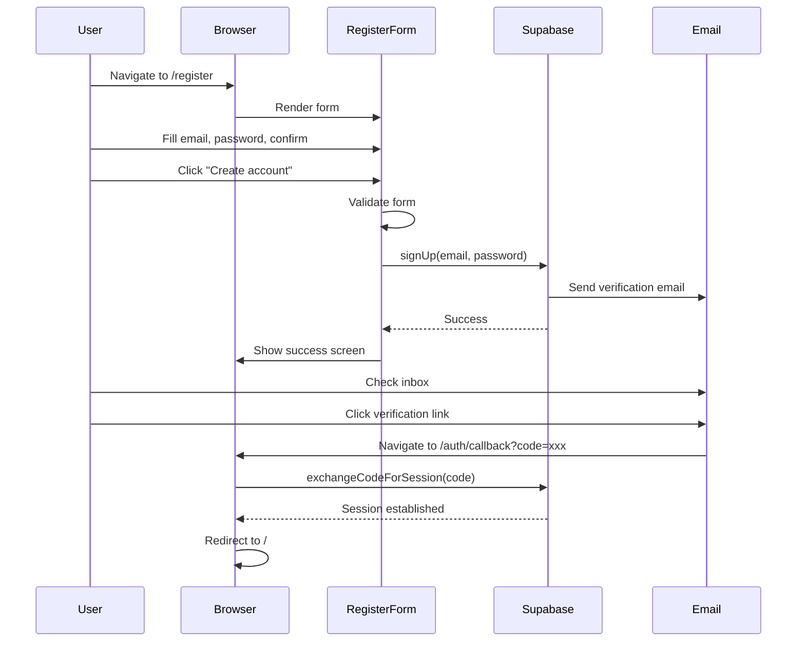

## Login Flow

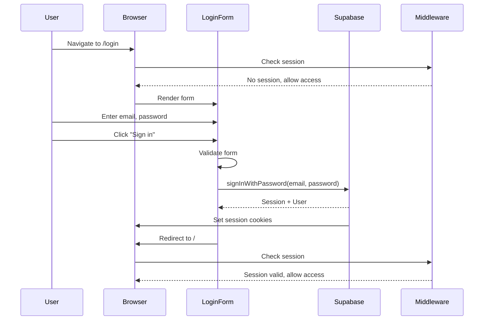

## Password Reset Flow

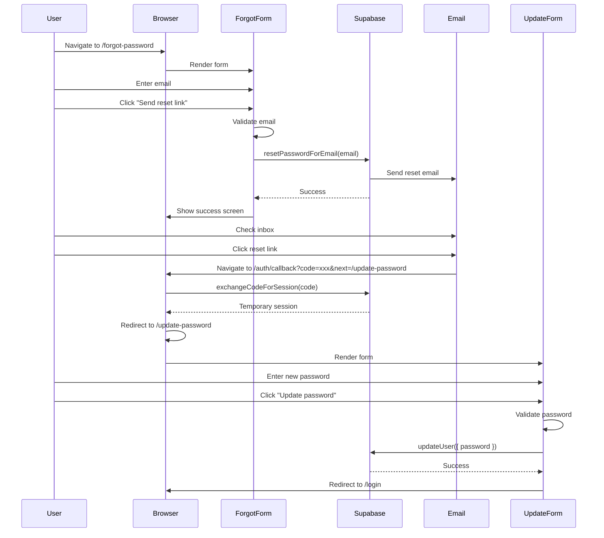

## Password Change Flow (Logged-in User)

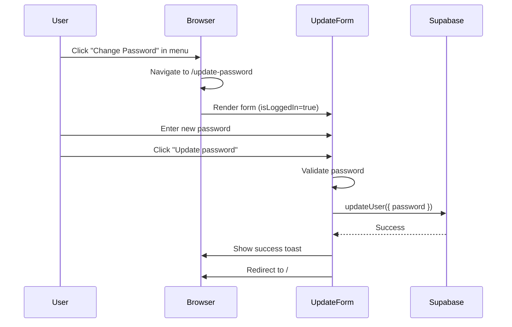

## Logout Flow

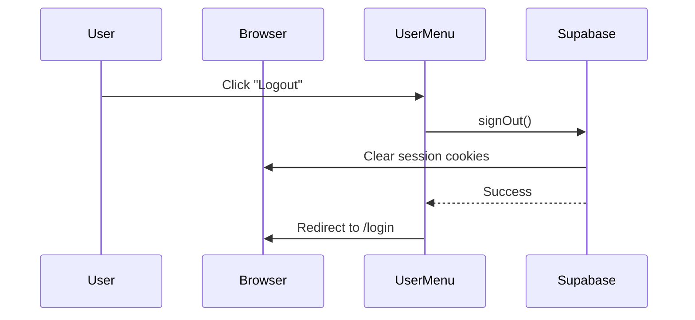

## Middleware Flow (Route Protection)

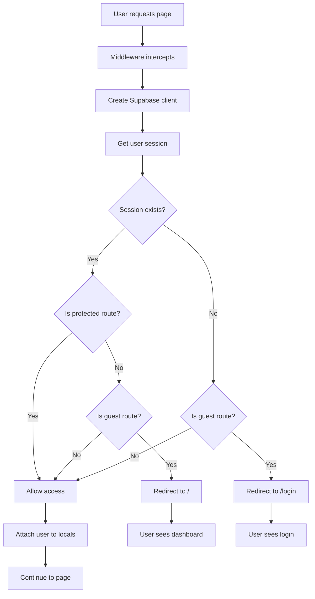

## Session Management Flow

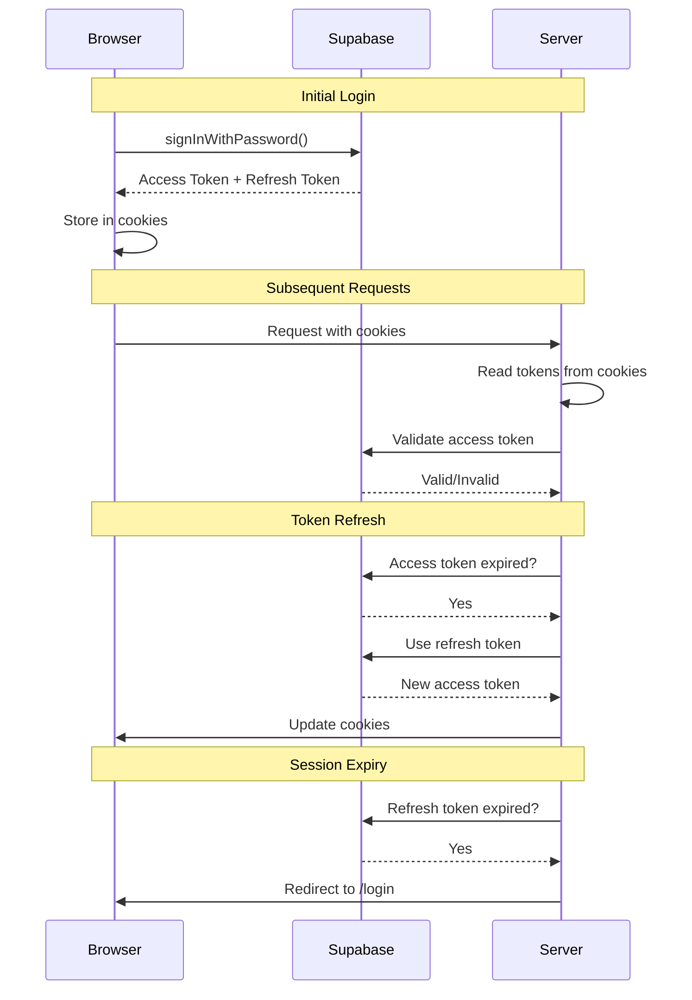

## Email Verification Flow

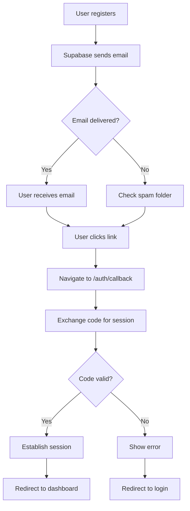

## Complete User Journey

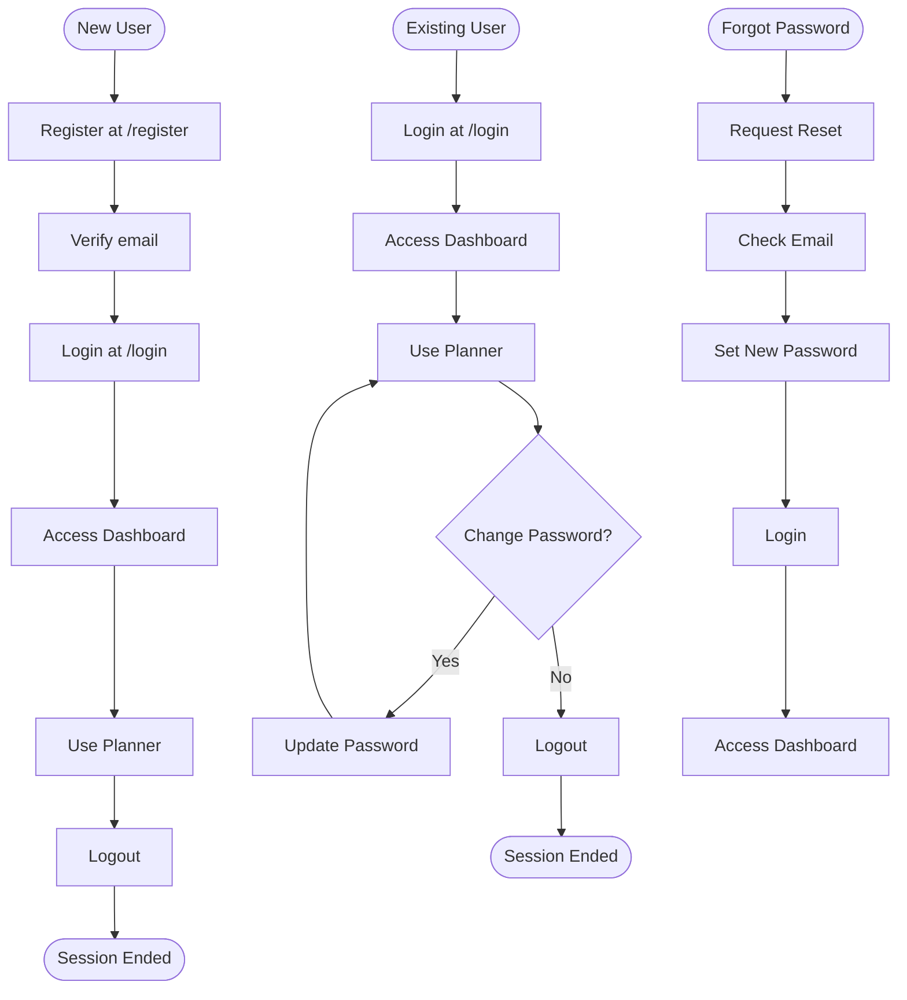

## Error Handling Flow

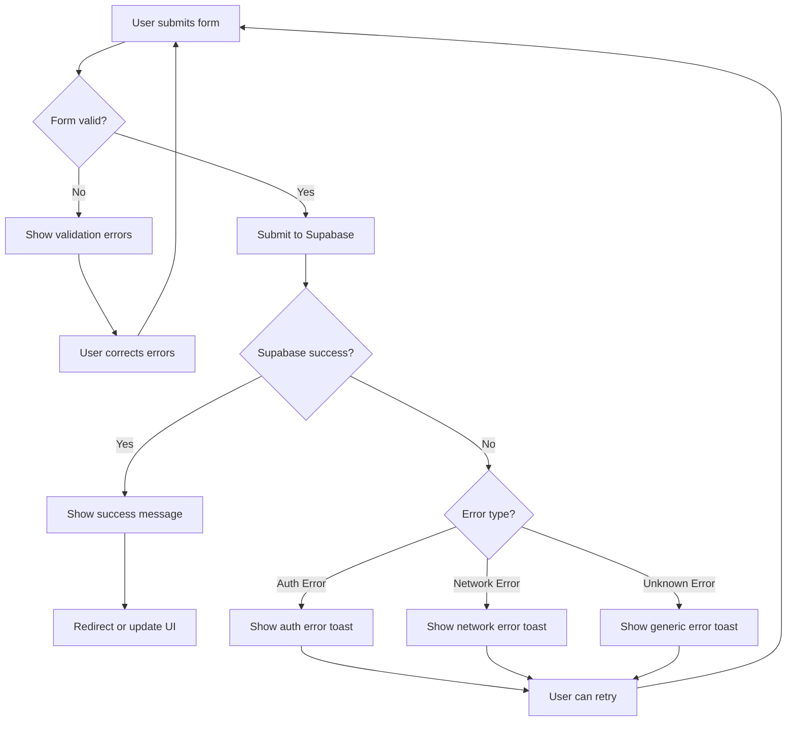

## Route Protection Matrix

```mermaid
flowchart LR
    subgraph Public Routes
        A1[/login]
        A2[/register]
        A3[/forgot-password]
    end
    
    subgraph Semi-Protected Routes
        B1[/update-password]
    end
    
    subgraph Protected Routes
        C1[/plans]
        C2[/dashboard]
        C3[/settings]
    end
    
    User{User Status}
    
    User -->|Not Logged In| Public Routes
    User -->|Not Logged In| B1
    User -->|Not Logged In| X[Redirect to /login]
    
    User -->|Logged In| Y[Redirect to /]
    User -->|Logged In| B1
    User -->|Logged In| Protected Routes
    
    X -.->|Blocks access to| Protected Routes
    Y -.->|Blocks access to| Public Routes
```

## State Diagram

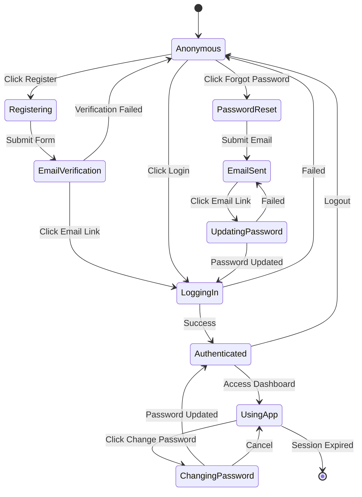

---

## Legend

### Sequence Diagrams
- **Participant**: Actor or system component
- **Arrow (->)**: Synchronous call
- **Dashed Arrow (-->>)**: Response
- **Note**: Additional context

### Flowcharts
- **Rectangle**: Process/Action
- **Diamond**: Decision point
- **Rounded Rectangle**: Start/End
- **Dashed Arrow**: Conditional flow

### State Diagrams
- **State**: Current user state
- **Transition**: Action that changes state
- **[*]**: Initial/Final state

---

## Usage Notes

These diagrams illustrate:
1. **User flows**: How users interact with the system
2. **System flows**: How components communicate
3. **Error handling**: What happens when things go wrong
4. **Security**: How routes are protected
5. **Session management**: How sessions are maintained

Use these diagrams to:
- Understand the authentication system
- Debug issues
- Plan new features
- Onboard new developers
- Document the system
