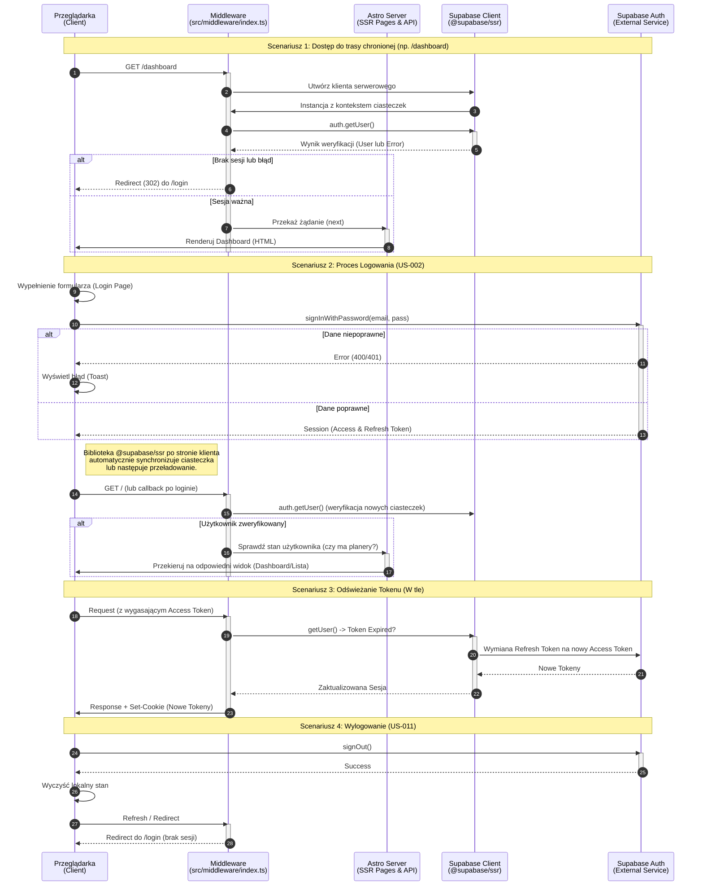

# Diagram Autentykacji

<authentication_analysis>

1. **Przepływy autentykacji (wg docs/auth-spec.md):**
   - **Rejestracja (US-001):** Użytkownik podaje dane -> Supabase Auth (signUp) -> Email weryfikacyjny -> Link callback -> Utworzenie sesji.
   - **Logowanie (US-002):** Użytkownik podaje dane -> Supabase Auth (signInWithPassword) -> Ustawienie ciasteczek sesyjnych (via @supabase/ssr) -> Przekierowanie na Dashboard (jeśli ma planery) lub listę planerów.
   - **Ochrona Tras (Middleware):** Weryfikacja sesji przy każdym żądaniu do chronionych tras (/plans, /dashboard). Przekierowanie do /login przy braku sesji.
   - **Odświeżanie Tokenu:** Automatyczna obsługa przez bibliotekę Supabase (refresh token). Middleware weryfikuje ważność i odświeża w razie potrzeby.
   - **Wylogowanie (US-011):** Wywołanie signOut -> Wyczyszczenie ciasteczek -> Przekierowanie do /login.

2. **Główni Aktorzy:**
   - **Przeglądarka (Browser):** Klient, formularze logowania/rejestracji (React Components).
   - **Middleware (Astro):** `src/middleware/index.ts` - "Strażnik", weryfikuje ciasteczka i sesję.
   - **Astro Server:** Renderowanie stron (SSR), API Routes.
   - **Supabase Client:** Helpery `client.ts` (browser) i `server.ts` (server).
   - **Supabase Auth:** Zewnętrzna usługa (Baza Danych/Auth Service).

3. **Weryfikacja i Odświeżanie:**
   - Tokeny przechowywane są w ciasteczkach (`sb-access-token`, `sb-refresh-token`).
   - Middleware używa `createServerClient` do odczytu ciasteczek i weryfikacji użytkownika (`getUser()`).
   - Jeśli token wygasł, Supabase Client wewnątrz middleware próbuje go odświeżyć używając refresh tokena i aktualizuje ciasteczka w odpowiedzi (Response).

4. **Opis kroków (skrócony):**
   - Żądanie strony -> Middleware sprawdza sesję.
   - Logowanie -> Strzał do Supabase -> Zwrot sesji -> Zapis ciasteczek -> Przeładowanie.
     </authentication_analysis>

<mermaid_diagram>

</mermaid_diagram>
