# Login Flow - Diagram Przepływu

## Pełny Przepływ Logowania


## Middleware Flow (Każdy Request)


## Smart Redirect Logic (index.astro)


## Error Handling Flow

```mermaid
flowchart TD
    Start([Form Submit]) --> ClientValidation{Client-side<br/>validation}
    
    ClientValidation -->|Fail| ShowFieldError[Show error<br/>under field]
    ClientValidation -->|Pass| SendAPI[POST /api/auth/login]
    
    SendAPI --> ServerValidation{Zod<br/>validation}
    
    ServerValidation -->|Fail| Return400[Return 400<br/>+ field details]
    ServerValidation -->|Pass| CallSupabase[Call Supabase<br/>signInWithPassword]
    
    CallSupabase --> AuthCheck{Auth<br/>successful?}
    
    AuthCheck -->|Fail| Return401[Return 401<br/>Generic message]
    AuthCheck -->|Pass| Return200[Return 200<br/>+ user data]
    
    Return400 --> DisplayFieldErrors[Display errors<br/>under fields]
    Return401 --> DisplayToast[Display toast<br/>"Invalid email or password"]
    Return200 --> Success[Toast + Redirect]
    
    ShowFieldError --> End([User can retry])
    DisplayFieldErrors --> End
    DisplayToast --> End
    Success --> End2([Redirect to /])
```

## Cookie Management


## State Diagram


## Component Interaction

```mermaid
graph TB
    subgraph Client["Client-Side (Browser)"]
        LoginForm[LoginForm.tsx<br/>React Component]
        Toast[Sonner Toast]
    end
    
    subgraph Server["Server-Side (Astro SSR)"]
        LoginPage[login.astro]
        IndexPage[index.astro]
        API[/api/auth/login.ts]
        MW[middleware/index.ts]
    end
    
    subgraph Supabase["Supabase Services"]
        Auth[Auth Service]
        DB[(Database)]
    end
    
    subgraph Helpers["Helpers"]
        BrowserClient[lib/supabase/client.ts]
        ServerClient[lib/supabase/server.ts]
    end
    
    LoginPage -->|Renders| LoginForm
    LoginForm -->|POST| API
    API -->|Uses| ServerClient
    ServerClient -->|Calls| Auth
    Auth -->|Sets| Cookies[HTTP Cookies]
    
    LoginForm -->|Redirect| IndexPage
    IndexPage -->|Uses| MW
    MW -->|Uses| ServerClient
    ServerClient -->|Reads| Cookies
    ServerClient -->|Validates| Auth
    
    IndexPage -->|Queries| DB
    
    LoginForm -->|Shows| Toast
    
    style LoginForm fill:#e1f5ff
    style API fill:#fff4e1
    style MW fill:#fff4e1
    style Auth fill:#e8f5e9
    style DB fill:#e8f5e9
```

## Security Flow

```mermaid
flowchart TD
    Start([User Input]) --> ClientVal[Client Validation<br/>Email format, required fields]
    
    ClientVal --> HTTPS{HTTPS?}
    HTTPS -->|No| Warn[⚠️ Insecure in production]
    HTTPS -->|Yes| SendData[Send to API]
    
    SendData --> ZodVal[Zod Validation<br/>Server-side]
    ZodVal --> RateLimit{Rate Limit<br/>Future}
    
    RateLimit -->|Exceeded| Block[Block request]
    RateLimit -->|OK| Supabase[Supabase Auth]
    
    Supabase --> CheckCreds{Valid<br/>credentials?}
    
    CheckCreds -->|No| Generic[Return generic error<br/>No user enumeration]
    CheckCreds -->|Yes| SetCookies[Set secure cookies<br/>httpOnly, secure, sameSite]
    
    SetCookies --> JWT[Generate JWT tokens<br/>Access + Refresh]
    JWT --> Success[Return success]
    
    Generic --> End([User retries])
    Block --> End
    Success --> Authenticated([Authenticated state])
    
    style Generic fill:#ffe0e0
    style SetCookies fill:#e0ffe0
    style JWT fill:#e0ffe0
```



---

## Legenda

- **🟦 Niebieski**: Client-side components
- **🟨 Żółty**: Server-side components  
- **🟩 Zielony**: External services (Supabase)
- **🟥 Czerwony**: Error states
- **⬜ Biały**: Neutral/Flow

## Notatki

1. **Cookies są ustawiane automatycznie** przez Supabase po udanym logowaniu
2. **Middleware działa na każdym request** - sprawdza sesję z cookies
3. **Smart redirect** w index.astro decyduje gdzie przekierować użytkownika
4. **Błędy są generyczne** dla bezpieczeństwa (no user enumeration)
5. **Walidacja działa na 2 poziomach**: client (UX) + server (security)
