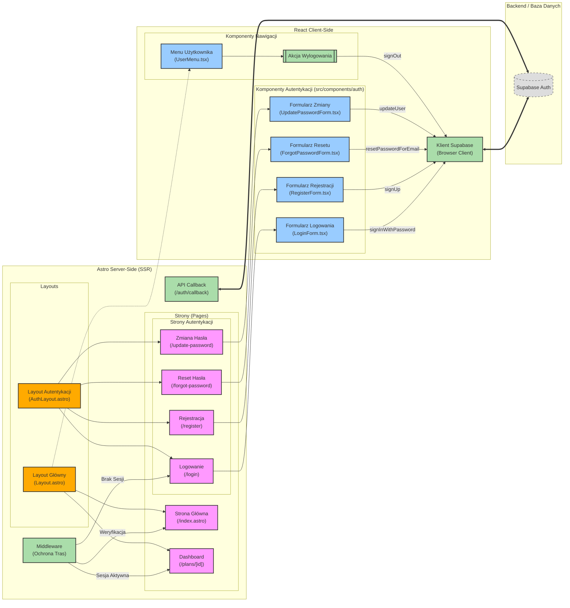

# Diagram Architektury UI - Autentykacja

Poniższy diagram przedstawia architekturę interfejsu użytkownika dla modułu autentykacji, uwzględniając podział na renderowanie po stronie serwera (Astro SSR) oraz komponenty klienckie (React).

<mermaid_diagram>

</mermaid_diagram>
